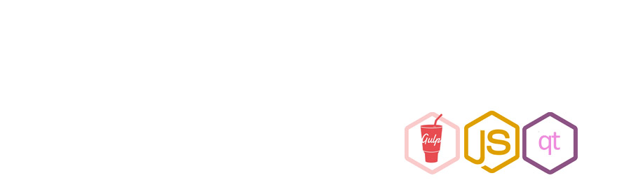
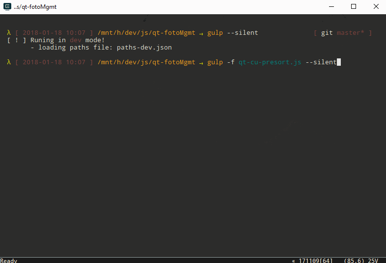

# qt-fotoMgmt [](https://github.com/prettier/prettier)

> Node.js script for automating and managing photos build on top of [gulpjs](https://github.com/gulpjs/gulp).



## Installation

```sh
$ git clone https://github.com/qaraluch/qt-fotoMgmt.git qt-fotoMgmt
```

## Configuration

Set up paths in `paths.json` file for input and output directory configuration. Script uses `QT_FOTOMGMT` enviroment variable with `prod` value to use above mentioned path file. Otherwise, it uses `paths-dev.json` for development process. Use `paths-reference.json` file as reference.

## Usage

To run specific task type in console:

```sh
gulp -f <gulpFile> <task> --silent
```

List of gulp files with their tasks:

* `qt-cu-backup` - run it for temporary backup photos for time of manipulate photos (default task).

* `qt-cu-backup removeBackups` - deletes temporary backup files.

* `qt-cu-presort` - preliminary renaming photos
* `qt-tool-normalizeName` - normalize photos date in the name in the cwd.
  Normalize form cwd. Rename in place. No dependant on
  enviroment variable: `QT_FOTOMGMT`.

  --path <customPath> - pass in different path to working dir

  Example:
  `gulp -f qt-tool-normalizeNames.js --silent --path <pathToWorkingDir>`

* `qt-tool-renameAfterDir` - add paretn dir name to the name of the foto.
  Normalize form cwd. Rename in place. No dependant on
  enviroment variable: `QT_FOTOMGMT`.

  --path <customPath> - pass in different path to working dir

  Example:
  `gulp -f qt-tool-renameAfterDir.js --silent --path <pathToWorkingDir>`

## License

MIT © [qaraluch](https://github.com/qaraluch)
